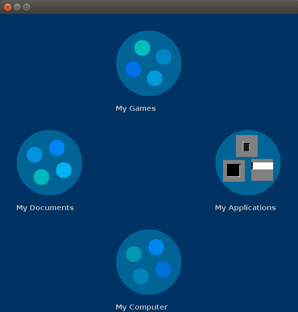

This is a mock operating system UI I made for my computer science class in my senior year of high school (2005). I added a project.clj and a main method so it can be built with Leiningen, but other than that the code is completely unmodified.
